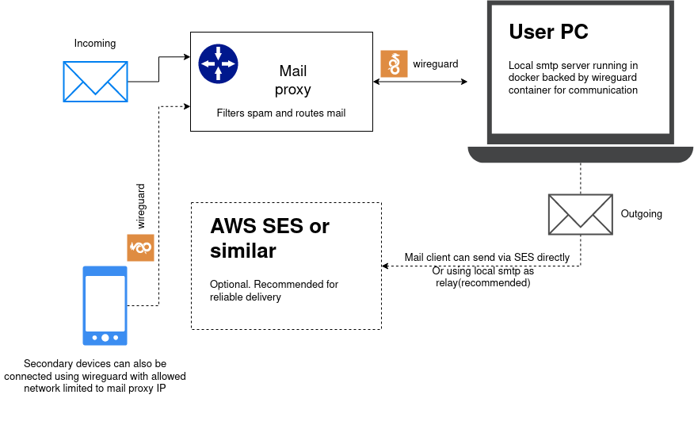

# Selfymail

Launching self mail hosting has always been pain in the ass. Generaly you need VPS or similar to host and pay for it. Besides you need to set up and manage all antispam services to prevent you from being spammed. 

The aim of Selfymail is to make running self hosted mail as easy as possible.

### Architecture

Under the hood selfymail uses great [Maddy mail server](https://maddy.email/) which is written in Go and includes SMTP/POP3/IMAP in one single binary with low usage footprint.

### Requirements

* Domain name and access to DNS zone editing
* Docker with docker compose module
* Telegram account to access selfymailbot
* (optional) AWS SES, sendgrid of something similar if you want to send email and be sure it is delivered well

### Installation

* Clone this repository
* Access telegram bot @selfymailbot to get the token. You need to set correct MX record during this step
* Wait to be approved (usually it takes up to several hours, but automation is in TODO)
* Run `./selfymail.sh` and provide aquired token to get wireguard config. Docker compose will be launched.

### Usage

##### Create email boxes

run `./addmbox.sh some@mailbox.com`

##### Setup email client
Since currently selfymail comes without webmail (but it is in TODO) you have to set up email client to use you new mailserver.
Use localhost:993 for imap and localhost:587 for email smtp port. If client is remote you have to define valid IP address.

If you use wireguard (default), then your mail server has IP  192.168.X.2 and you can use it in remote email clients in the same wireguard network.